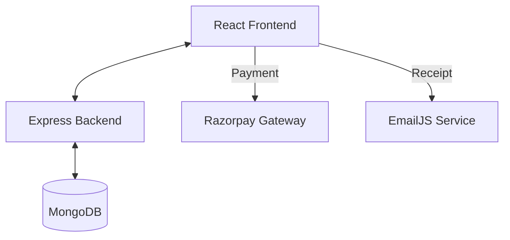

# 🦅 Travora Trip – Project Workflow Documentation

This document provides a technical walkthrough of how the **Travora Trip** MERN application functions, covering system architecture, user roles, and core business logic flows.

---

## 🏗️ System Architecture

The application follows a standard **MERN Stack** architecture with a clear separation of concerns:

- **Frontend (Client)**: React.js application using React-Bootstrap for UI, Axios for API calls, and Context API for global state (Auth).
- **Backend (Server)**: Node.js/Express.js REST API.
- **Database**: MongoDB (NoSQL) for storing users, trips, and bookings.
- **Cloud Services**:
  - **Razorpay**: Payment gateway integration.
  - **EmailJS**: Automated receipt emails.

---

## 👥 User Personas & Permissions

The system implements **Role-Based Access Control (RBAC)**:

| Feature | Tourist | Organizer | Admin |
| :--- | :---: | :---: | :---: |
| Browse Trips | ✅ | ✅ | ✅ |
| Book Trips | ✅ | ❌ | ✅ |
| Create/Manage Trips | ❌ | ✅ | ✅ |
| Manage Bookings | ❌ | ✅ (Own) | ✅ (All) |
| Dashboard Access | ❌ | ✅ | ✅ |

---

## 🔄 Core Workflows

### 1. Authentication Flow
Secure access is managed via JWT (JSON Web Tokens).

1.  **Registration**: User provides name, email, password, and chooses a **Role**.
2.  **Encryption**: Backend hashes the password using `bcryptjs`.
3.  **Token Generation**: On successful login/register, the backend signs a JWT with the User ID.
4.  **Security**: Token is stored in `localStorage` and sent in the `Authorization` header for all protected API calls.

### 2. Trip Discovery & Selection
1.  **Browsing**: Users browse trips on the `Places.jsx` page.
2.  **Filtering**: Server-side filtering by destination, price, and duration.
3.  **Selection**: Users click "Book Now" which passes trip data to the `Booking.jsx` page via `react-router-dom` state.

### 3. Booking & Payment Workflow (The Core Logic)
This is the most critical flow in the application:

1.  **Configuration**: User selects a travel date and counts for Adults/Children.
2.  **Calculation**: `Booking.jsx` calculates the `totalAmount` dynamically.
3.  **Order Creation**:
    - User clicks "Pay".
    - Frontend calls `/api/razorpay/create-order` to get a Razorpay Order ID.
4.  **Payment Processing**: The Razorpay SDK opens a secure popup for transaction details.
5.  **Confirmation & Persistence**:
    - On success, the frontend sends a `POST` request to `/api/bookings` with payment details.
    - The Backend creates a new `Booking` document linked to both the **Tourist** and the **Organizer**.
6.  **Notifications**: `EmailJS` is triggered immediately on the frontend to send a PDF-style receipt to the User's email.

### 4. Organizer Lifecycle
1.  **Creation**: Organizers use the Dashboard to create trips with day-by-day itineraries.
2.  **Monitoring**: The `OrganizerBookings` view shows all incoming bookings for their specific trips.
3.  **Status Management**: Organizers can update booking status (e.g., Confirmed, Completed) to track their logistics.

---

## ⚙️ Environment Configuration

To run the project, the following `.env` structures are required:

### Backend
- `MONGO_URI`: MongoDB connection string.
- `SECRET`: JWT secret key.
- `RAZORPAY_KEY_ID`: Razorpay public key.
- `RAZORPAY_KEY_SECRET`: Razorpay private key.

### Frontend
- `REACT_APP_API_URL`: Backend server URL.
- `REACT_APP_RAZORPAY_KEY_ID`: Public key for SDK.
- `REACT_APP_EMAILJS_SERVICE_ID`: Email service ID.
- `REACT_APP_EMAILJS_TEMPLATE_ID`: Receipt template ID.
- `REACT_APP_EMAILJS_PUBLIC_KEY`: EmailJS public key.
