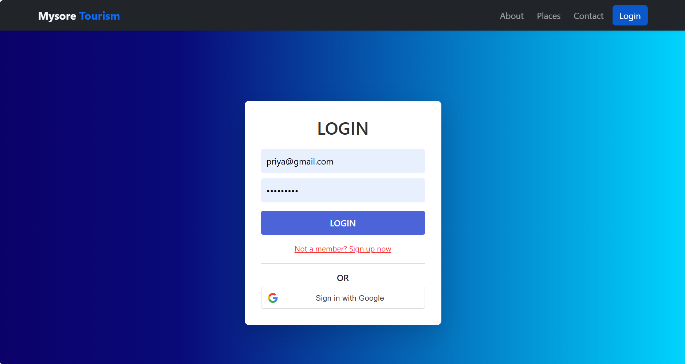
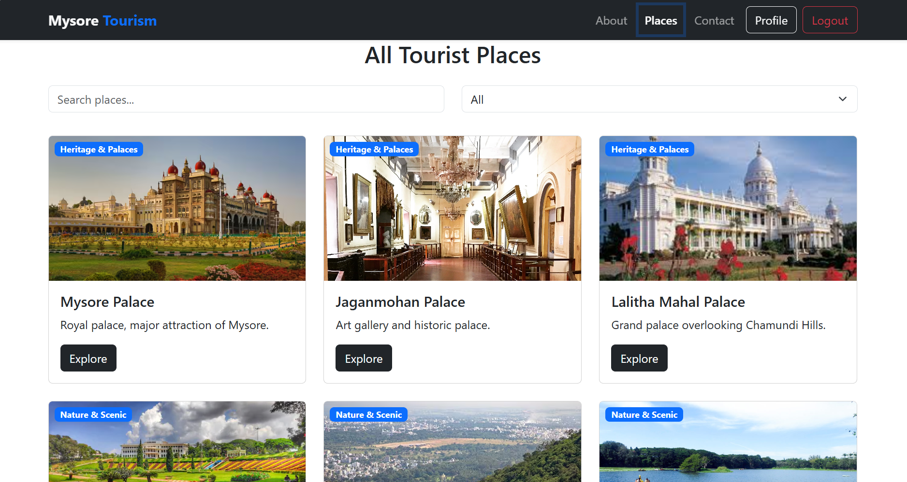
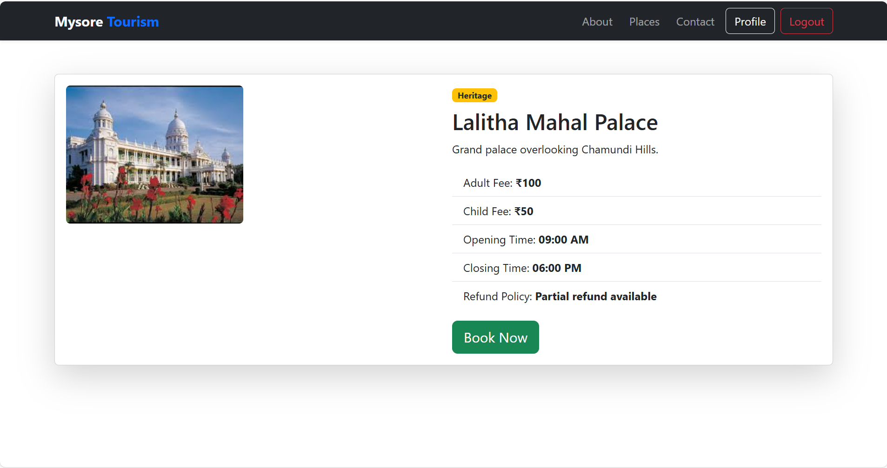
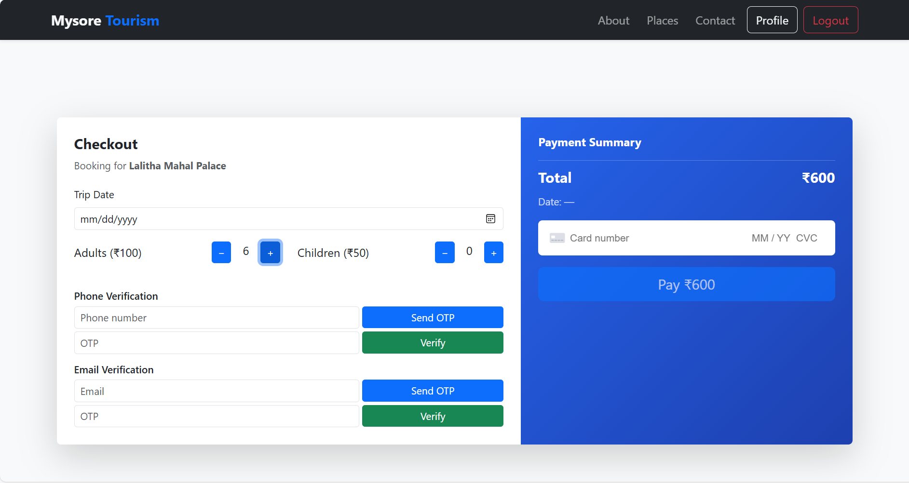
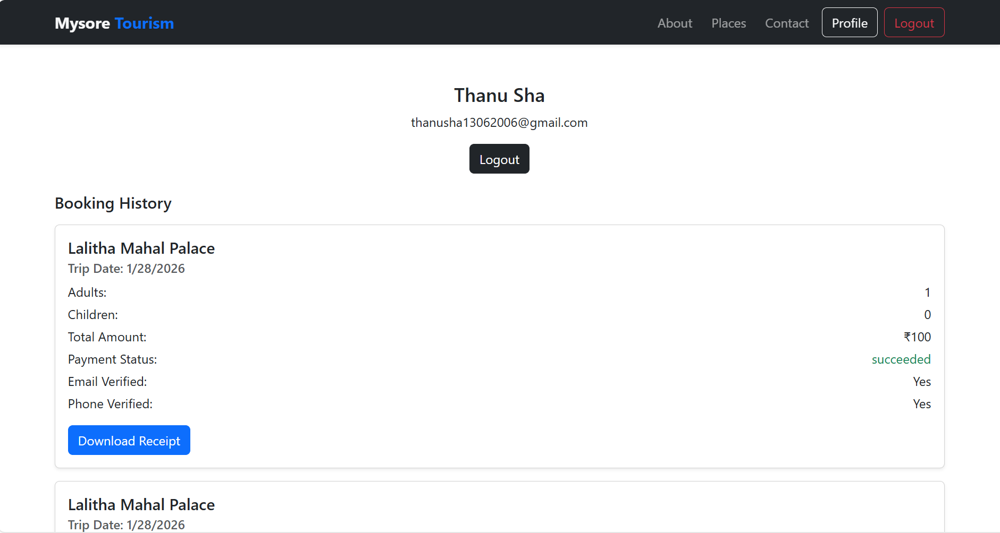

# 🧳 Mysore Trip Booking – MERN Stack Application

A full-stack **MERN (MongoDB, Express, React, Node.js)** web application for booking Mysore tourism trips and combo packages with **secure authentication**, **Stripe payments**, and a smooth checkout experience.

This project is built as a **real-world booking system** suitable for portfolios, interviews, and production-style learning.

---

## 🚀 Features

### 🔐 Authentication
- User Registration & Login
- Google OAuth Login
- JWT-based authentication
- Protected routes (Booking & Profile)

### 🗺️ Trip Booking
- Individual place booking
- Combo tour packages
- Select number of members (Adults & Children)
- Trip date selection
- Email & phone verification before payment

### 💳 Payments
- Stripe Payment Gateway integration
- Secure PaymentIntent flow
- Payment success / failure shown via popup (Toast)
- Booking saved only after successful payment

### 📦 Booking & Profile
- Save booking details to MongoDB
- View booking history
- Profile page with booking receipt
- Stores payment status & metadata

### 🎨 UI / UX
- Responsive design using React Bootstrap
- Carousel-based combo trip display
- Clean checkout UI
- Toast notifications instead of alerts

---

## 🛠️ Tech Stack

### Frontend
- React.js
- React Router DOM
- React Bootstrap
- Axios
- Stripe JS (`@stripe/react-stripe-js`)
- Google OAuth (`@react-oauth/google`)

### Backend
- Node.js
- Express.js
- MongoDB & Mongoose
- JWT Authentication
- Bcrypt.js
- Stripe API

---

---

## 📸 Application Screenshots

  
  

  
  

  
  

---

## 🔑 Environment Variables

### Backend (`backend/.env`)
-MONGO_URI=mongodb://127.0.0.1:27017/tripBookingDb
-SECRET=your_jwt_secret
-STRIPE_SECRET_KEY=your_stripe_secret_key

### Frontend (`frontend/.env`)
-REACT_APP_STRIPE_PUBLISHABLE_KEY=your_stripe_publishable_key
-REACT_APP_GOOGLE_CLIENT_ID=your_google_client_id

### 🔒 Protected Routes

-/booking
-/profile
-These routes are accessible only after login.

### 💡 Future Enhancements

-Admin dashboard
-Seat availability & capacity management
-Refund & cancellation system
-Email confirmation after booking
-Invoice PDF generation
-Role-based access (Admin/User)

### 👩‍💻 Author
-Thanusha
-Aspiring Full-Stack Developer (MERN)
-📍 India

### ⭐ Why This Project Stands Out

-Real-world booking & payment workflow
-Secure Stripe integration
-Google OAuth + JWT authentication
-Clean UI & UX
-Strong portfolio-level MERN project

---
