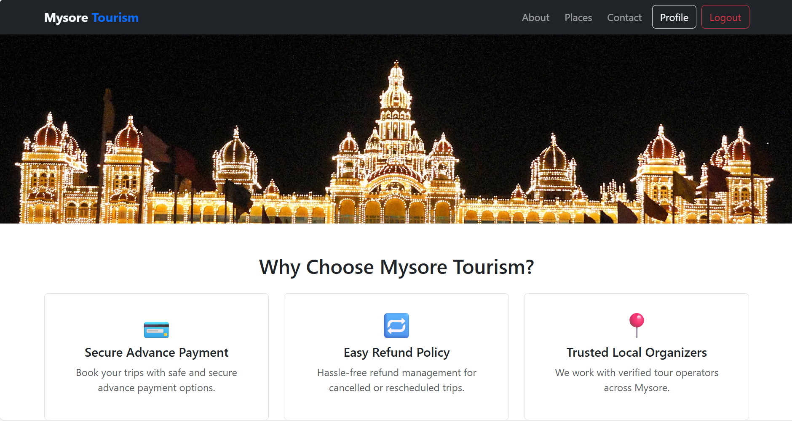

# 🧳 Travora Trip – Full-Stack MERN Travel Marketplace (Portfolio Showcase)

> [!NOTE]
> **This is a Showcase Repository.** 
> This repository is designed to showcase the architecture, UI/UX, and core technical implementation of the **Travora Trip** project. 
> 
> **To protect Intellectual Property:** The complete source code and logic are stored in a private repository. This showcase contains high-level documentation and selected code highlights.
> 
> **Recruiters & Hiring Managers:** If you would like to review the full codebase, please reach out via [LinkedIn](https://www.linkedin.com/in/your-profile/) or email. I am happy to provide access!

---

**Travora Trip** is a comprehensive full-stack **MERN (MongoDB, Express, React, Node.js)** platform designed for travel organizers and tourists. It facilitates seamless trip planning, dynamic itinerary management, and secure bookings with **Razorpay integration**.

### 🔗 [Live Demo: https://travora-trip.onrender.com](https://travora-trip.onrender.com)

---

## 🌟 Key Technical Highlights

In this showcase, I have included selected files in the `src_highlights/` directory to demonstrate my coding standards and problem-solving skills:

1.  **Secure Payment Integration**: [`RazorpayPayment.jsx`](./src_highlights/RazorpayPayment.jsx) - Implementation of the Razorpay checkout flow with real-time verification.
2.  **Dynamic UI & State Management**: [`Details.jsx`](./src_highlights/Details.jsx) - Complex React component handling dynamic pricing and itinerary scaling.
3.  **Backend Logic & API Design**: [`bookingController.js`](./src_highlights/bookingController.js) - Robust controller logic for handling bookings and pricing calculations.
4.  **Security & Middleware**: [`authMiddleware.js`](./src_highlights/authMiddleware.js) - Custom JWT-based authentication and role-based access control.

---

## 🚀 Key Features

### 🏢 Organizer Dashboard
- **Dynamic Itinerary Management**: Create day-by-day plans that automatically scale based on the selected trip duration.
- **Advanced Pricing**: Separate pricing for Adults and Children.
- **Logistics**: Specify Pick-up and Drop-off times for better trip coordination.

### 👥 Role-Based Access Control
- **Dual Personas**: Choose between **Tourist** and **Organizer** during registration.
- **Customized UI**: Navigation links and features adapt based on your selected role.

### 💳 Payments & Transactions
- **Razorpay Integration**: Seamless checkout and automated total amount calculation.
- **Real-time Verification**: Secure backend validation of transaction IDs.

---

## 📸 Website Preview

  
  

  
  

---

## 🛠️ Tech Stack

- **Frontend**: React.js, React Bootstrap, Axios, React Router.
- **Backend**: Node.js, Express.js.
- **Database**: MongoDB & Mongoose.
- **Security**: JWT & Bcrypt.js.
- **Payments**: Razorpay SDK.

---

## 👩‍💻 Author
- **Thanusha**
- Full-Stack Developer (MERN)
- 📍 India
